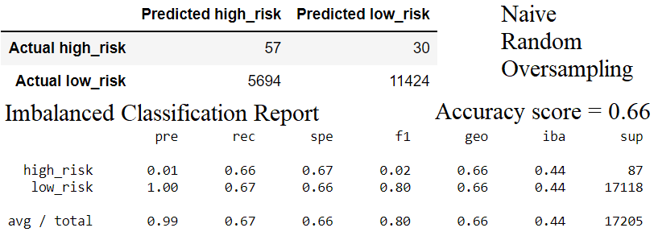
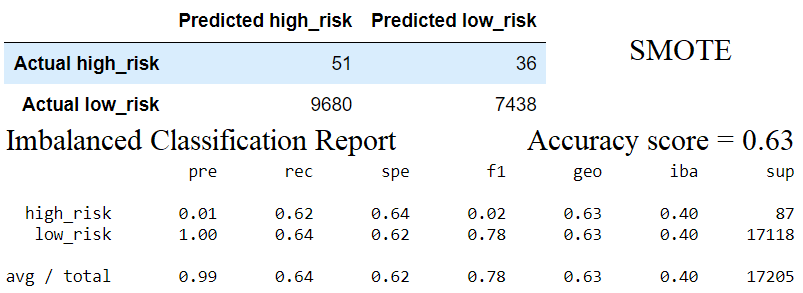
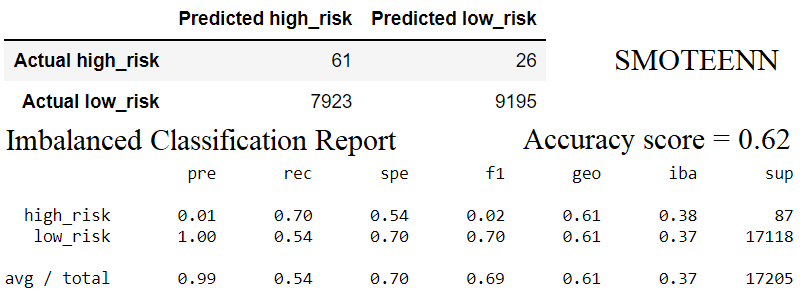
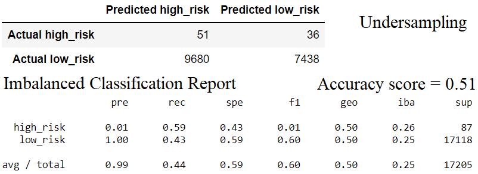
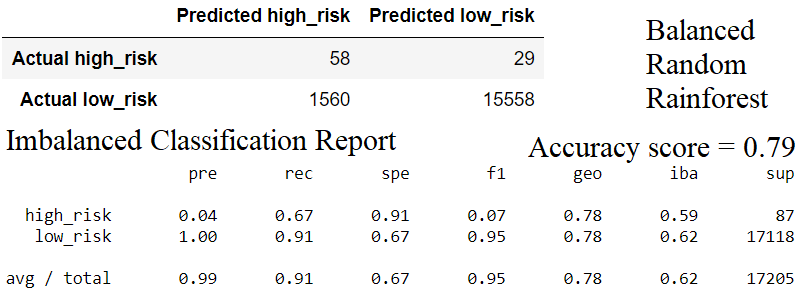
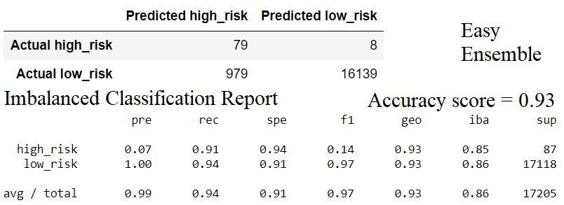

# Credit_Risk_Analysis
- Evaluate several machine learning models to assess credit card risk.

# Results:

# Summary:

- The rundown of model outcomes is introduced arranged by most noteworthy exactness score to least precision score. 

- The Easy Ensemble model has the most elevated precision score (0.93) and the F-1 score for okay (0.97) is additionally the most elevated. 

- The suggested model for Visa examination would be the Easy Ensemble model. 

- The Balanced Random Rainforest model has the second most noteworthy exactness score at 0.79 and the F-1 score is 0.95. 

- The Naïve Random Oversampling model has an exactness of 0.66 and a F-1 score of 0.80 for generally safe. 

- The SMOTE model has a precision score of 0.63 and the F-1 score is 0.78 for generally safe. 

- The SMOTEENN model has an exactness score of 0.62 and the F-1 score is 70 for okay. 

- UnderSampling has the most minimal precision score at 0.51 and F-1 score of 0.60. 

- On account of how low the two scores are the Undersampling model isn't suggested for Mastercard hazard examination.
